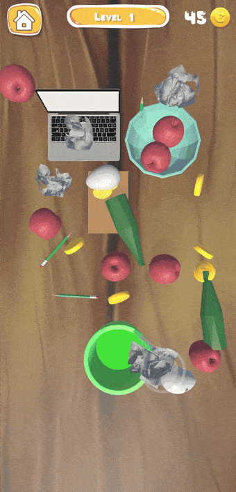

# Wash Trash 3D

Genres: Sorting, Match, Puzzle

**Download:** [Wash Trash 3D](https://disk.yandex.ru/d/qzMiVI6xxstw-w)

  

## Description:
The game was developed during the "Game Development in Unity" professional development course.
In each level, the player needs to clear the playing field of trash by matching objects of the same type.
The scene also contains objects that are not trash, which makes the gameplay more challenging.

  
  
  

## Key features:
- Mechanic of matching objects of the same type
- Handling player interaction with objects in the scene
- Drag & drop mechanic for objects
- Game loop managed by a Finite State Machine

## Technologies and approaches:
- Component-based architecture
- Event-driven communication between components (UnityEvents)
- Adaptive UI (Safe Area, support for different resolutions and both portrait and landscape orientations)
- Finite State Machine for the game loop (menu, gameplay, win)
- Scripted animations, Animator and DOTween
- Setting up imported 3D models animations
- Saving and loading data (JSON serialization)
- VFX (Particle System, Trail)
- Object Pooling for VFX optimization
- ScriptableObjects for storing player progress
- Visual design of game objects

## Possible improvements:
- Rework the UI switching system (currently implemented with Animator)
- Simplify the game state switching logic (currently implemented with 2 scripts on each element that switches the GameState)
- Split the responsibilities of Getter (separate the trash counting logic from the visual feedback)
- Improve the scene setup (collider positions, object spawn point)
- Move from static level loading (prefabs) to procedural generation
